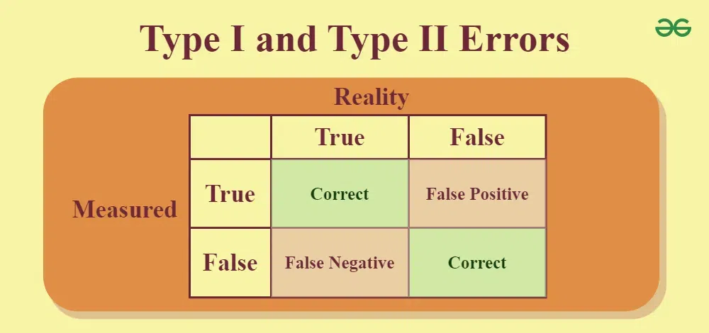
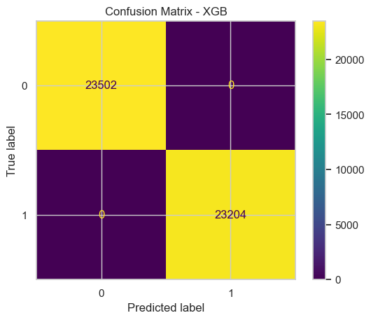

# 💳 Credit Card Fraud Detection


[](https://github.com/nazmul-1117/Machine-Learning-Projects/003-Credit_Card_Fraud_Detection)
[](https://github.com/nazmul-1117/Machine-Learning-Projects/003-Credit_Card_Fraud_Detection)
[](https://github.com/nazmul-1117/Machine-Learning-Projects/issues)
[](https://github.com/nazmul-1117/Machine-Learning-Projects)
[](https://github.com/nazmul-1117/Machine-Learning-Projects)
[](https://github.com/nazmul-1117/Machine-Learning-Projects)
[](https://github.com/nazmul-1117/Machine-Learning-Projects)
[](LICENSE)


## 📌 Project Overview

This project aims to build a **machine learning model** capable of detecting **fraudulent credit card transactions** from a highly imbalanced dataset.  
The work is based on the publicly available **Kaggle Credit Card Fraud Detection dataset**, which contains anonymized transaction features and a binary target label:

- **0** → Legitimate transaction  
- **1** → Fraudulent transaction  

Fraud detection is a critical application in **financial security**, protecting customers and institutions from monetary loss and increasing trust in digital transactions.

---

## 🎯 Objectives

- **Detect fraudulent transactions** with high recall to minimize missed fraud cases.  
- **Handle class imbalance** using resampling techniques and/or specialized algorithms.  
- **Compare and evaluate** multiple models and imbalance-handling approaches.  
- **Build a reproducible workflow** for future fraud detection projects.

---

## 📂 Dataset Description

**Source:** [Kaggle - Credit Card Fraud Detection](https://www.kaggle.com/mlg-ulb/creditcardfraud)

- **Rows:** 284,807  
- **Fraud Cases:** 492 (~0.172% of the dataset)  
- **Features:**  
  - `Time` — seconds elapsed since the first transaction  
  - `V1`–`V28` — PCA-transformed features (anonymized)  
  - `Amount` — transaction amount  
  - `Class` — target variable (0 = non-fraud, 1 = fraud)

**Key Challenge:** Extreme **class imbalance** where fraudulent cases are less than 0.2% of the data.

---

## 🔄 Workflow

### 1. **Data Preprocessing**
- Handle missing values (if any)
- Feature scaling (especially `Amount` and `Time`)
- Train-test split

### 2. **Exploratory Data Analysis (EDA)**
- Distribution of features for fraudulent vs. non-fraudulent transactions
- Class imbalance visualization
- Correlation analysis

### 3. **Imbalance Handling**
- **Oversampling** (SMOTE)
- **Undersampling**
- **Algorithmic approaches** (e.g., anomaly detection models)

### 4. **Model Training**
- Logistic Regression
- Decision Trees / Random Forest
- XGBoost / LightGBM
- Isolation Forest / Local Outlier Factor (for anomaly detection)

### 5. **Model Evaluation**
- Precision, Recall, F1-Score
- ROC-AUC and PR-AUC curves
- Confusion Matrix

---

## 📊 Evaluation Metrics

Since fraud detection is a **rare event classification problem**, **accuracy** is not a reliable measure.  
We prioritize:
- **Recall (Sensitivity)** — Maximize detection of actual fraud cases  
- **Precision** — Minimize false positives  
- **F1-Score** — Balance between Precision and Recall  
- **AUC-PR** — Area under Precision-Recall curve (important for imbalanced data)

---

## ✨ Machine Learning Models and Performance

The project evaluates various machine learning models for churn prediction, with **XGBoost** emerging as the best-performing model.

### Model Accuracy Comparison

| Model No. | Name               | Accuracy (%) |
|-----------|--------------------|--------------|
| model1    | Logistic Regression| 99.39        |
| model2    | Decision Tree      | 98.78        |
| model3    | XGBoost            | 100.00       |
| model4    | SVM                | 99.41        |
| model5    | KNN                | 99.94        |
| model6    | Neural Network     | 100.00       |


### Final Model Performance: `XGBoost`

| Dataset    | Accuracy % |
| :--------- | :--------- |
| Train      |   100      |
| Validation |   100      |
| Test       |   100      |

* The **XGBoost** achieved a robust **100% accuracy on the unseen test data**.

### Why Not `Neural Network`
- **Goal**: Reduce Error but mainly consider,
  - Type 1 (False Positive) Error Should be Minimul (Carefull)
  - Type 2 (False Negative) Error Should be anything

**Error**:

|                | Predicted Positive | Predicted Negative |
|----------------|--------------------|--------------------|
| Actual Positive| True Positive      | False Negative     |
| Actual Negative| False Positive     | True Negative      |



## 📊 Model Comparison: XGBoost vs Neural Network

This project compares the performance of two machine learning models—**XGBoost** and a **Neural Network**—on a classification task. Below are their respective confusion matrices, which visually represent prediction accuracy and error distribution.

### 🔍 Confusion Matrices

<table>
  <tr>
    <td><strong>XGBoost</strong><br></td>
    <td><strong>Neural Network</strong><br></td>
  </tr>
</table>

### 📈 Performance Summary

| Metric            | XGBoost | Neural Network |
|-------------------|---------|----------------|
| Accuracy          | 100%    | 100%           |
| Precision         | 100%    | 100%           |
| Recall            | 100%    | 100%           |
| F1 Score          | 100%    | 100%           |

### 🧠 Model Details

**XGBoost**
- Gradient boosting framework optimized for speed and performance.
- Handles missing data and categorical features efficiently.
- Great for tabular datasets.

**Neural Network**
- Deep learning model with multiple hidden layers.
- Capable of capturing complex nonlinear relationships.
- Requires more data and tuning but can generalize well.

---

## 🛠 Technologies & Libraries

- **Python 3.x**
- `pandas`, `numpy` — Data manipulation
- `matplotlib`, `seaborn` — Visualization
- `scikit-learn` — Modeling & metrics
- `imbalanced-learn` — SMOTE, undersampling
- `xgboost` / `lightgbm` — Gradient boosting models

---

## 📌 Project Structure

```

credit-card-fraud-detection/
│
├── data/
│   ├── raw/                # Original dataset (not committed to Git)
│   └── processed/          # Cleaned and prepared datasets
│
├── notebooks/
│   ├── 01-eda.ipynb        # Exploratory Data Analysis
│   └── 02-modeling.ipynb   # Model training and evaluation
│
├── src/
│   ├── preprocess\_data.py  # Data preprocessing scripts
│   ├── train\_model.py      # Model training pipeline
│   └── predict.py          # Fraud prediction script
│
├── models/                 # Saved trained models
│
├── requirements.txt
├── README.md
└── .gitignore

```

---

## ⚠️ Ethical Considerations

- Data is anonymized and publicly available for research purposes.  
- In real-world applications, false positives may inconvenience customers; false negatives may result in financial loss.  
- Model deployment should involve human-in-the-loop verification for flagged transactions.

---

## 📈 Next Steps

- Experiment with **deep learning models** (e.g., autoencoders for anomaly detection)  
- Optimize hyperparameters using cross-validation  
- Deploy as an API for real-time fraud detection

---

## 📚 References

- Kaggle Dataset: https://www.kaggle.com/mlg-ulb/creditcardfraud  
- Imbalanced-learn Documentation: https://imbalanced-learn.org  
- Scikit-learn Documentation: https://scikit-learn.org

---

## AUTHOR

- **Author:** [Md. Nazmul Hossain](https://github.com/nazmul-1117)
- **Kaggle:** [Md. Nazmul Hossain](https://www.kaggle.com/nazmul1117)
- **Contact:** [Instagram](https://www.instagram.com/nazmul.1117/)