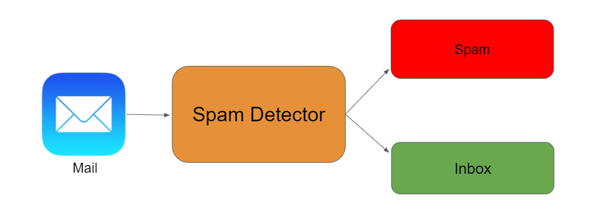

# Step-by-Step Documentation — Email classification with scikit-learn



Below is a complete, practical guide to build, evaluate and deploy an email classifier using **scikit-learn**. It covers dataset format, preprocessing, feature extraction, modeling, evaluation, hyperparameter tuning, and deployment. Example code snippets are included so you can copy/paste and run.

> Assumptions: you have Python 3.8+, scikit-learn, pandas, numpy, joblib, and optionally matplotlib installed. This doc focuses on text classification (body/subject), not attachment parsing.

---

# 1. Problem statement

Classify incoming emails into categories (for example: `spam` vs `ham`, or `support`, `sales`, `personal`, etc.) using classical ML (no deep learning required). Goals:

* Reliable model with explainable features
* Reproducible pipeline for preprocessing → feature extraction → model
* Evaluation with appropriate metrics (precision, recall, F1)
* Saved artifact for production inference

---

# 2. Dataset format

Prefer simple CSV/Parquet with columns like:

```
id,label,subject,body,sender,date
1,spam,"Win $$$ now","You have been selected!!! ...","promo@example.com","2021-06-01"
2,ham,"Re: meeting","Let's meet tomorrow at 10...","boss@example.com","2021-06-02"
```

Minimum required fields: `id`, `label`, and at least one textual field (`subject` or `body`).

If you use public datasets: Enron, SpamAssassin, TREC datasets are common starting points.

---

# 3. High-level pipeline

1. Load data
2. Exploratory data analysis (class balance, text length, common tokens)
3. Clean / preprocess text (remove signatures, normalise)
4. Split train/test (stratified)
5. Build feature extraction pipeline (Tfidf/Count, n-grams, custom features)
6. Train baseline model (MultinomialNB or LogisticRegression)
7. Evaluate on validation/test sets
8. Hyperparameter tuning (GridSearchCV / RandomizedSearchCV)
9. Save pipeline (joblib)
10. Deploy/inference code

---

# 4. Preprocessing (practical tips)

* Lowercase text
* Remove HTML tags (if emails are HTML)
* Strip quoted reply text (if you want to focus on new content)
* Optionally remove signatures (common pattern: `-- ` or `Regards, Name`)
* Normalize whitespace, remove control characters
* Keep numbers sometimes (they can be discriminative)
* Consider stemming/lemmatization only if required (Tfidf + logistic usually fine without stemming)
* Keep stopwords? Usually remove them for bag-of-words, but experiment.

Example simple cleaning helper:

```python
import re
from bs4 import BeautifulSoup    # optional, for HTML

def clean_email_text(text):
    if not isinstance(text, str):
        return ""
    # remove HTML
    text = BeautifulSoup(text, "html.parser").get_text(separator=" ")
    # remove quoted replies (common markers)
    text = re.split(r'\nOn .* wrote:', text)[0]
    # remove signatures (simple heuristic)
    text = re.split(r'\n--\n', text)[0]
    # normalize whitespace
    text = re.sub(r'\s+', ' ', text).strip()
    return text.lower()
```

(If you cannot use BeautifulSoup, remove HTML tags via regex with caution.)

---

# 5. Feature engineering

Primary approach: bag-of-words / TF-IDF over `subject` + `body`.

* `TfidfVectorizer` with `ngram_range=(1,2)` is a strong baseline.
* Limit `max_features` (e.g., 50k) to control memory.
* Use `min_df` to drop extremely rare tokens.

Add simple structured features (optional but useful):

* Email length features: `len(body)`, `len(subject)`
* Count of links: number of occurrences of `http` or `www`
* Number of capital words or % caps (spam often uses ALL CAPS)
* Whether sender is in internal domain
* Presence of certain keywords (free, win, urgent, invoice)

Combine text vectorizer and structured features with `FeatureUnion` or `ColumnTransformer`.

---

# 6. Modeling choices (baseline → strong)

* Fast baseline: **Multinomial Naive Bayes** (works well with word counts).
* Strong, robust: **LogisticRegression (saga / liblinear)** with `class_weight='balanced'` if imbalance exists.
* SVM (LinearSVC) is also common.
* If you need probability estimates, use `CalibratedClassifierCV` around LinearSVC (or use logistic/regression which gives `predict_proba`).
* For imbalanced classes consider `class_weight`, oversampling (SMOTE) or threshold tuning.

---

# 7. Example: end-to-end runnable script (concise)

```python
# email_classifier.py
import pandas as pd
import numpy as np
from sklearn.model_selection import train_test_split, GridSearchCV, StratifiedKFold
from sklearn.feature_extraction.text import TfidfVectorizer
from sklearn.pipeline import Pipeline
from sklearn.linear_model import LogisticRegression
from sklearn.metrics import classification_report, confusion_matrix
from sklearn.compose import ColumnTransformer
from sklearn.preprocessing import FunctionTransformer
import joblib

# 1. Load data
df = pd.read_csv("emails.csv")   # contains id,label,subject,body
df['text'] = df['subject'].fillna('') + " " + df['body'].fillna('')

# 2. Simple cleaning
def clean_text_series(series):
    import re
    from bs4 import BeautifulSoup
    def f(x):
        if not isinstance(x, str):
            return ""
        txt = BeautifulSoup(x, "html.parser").get_text(separator=" ")
        txt = re.sub(r'\s+', ' ', txt).strip()
        return txt.lower()
    return series.apply(f)

df['text_clean'] = clean_text_series(df['text'])

# 3. Train/test split
X = df[['text_clean']]
y = df['label']
X_train, X_test, y_train, y_test = train_test_split(
    X, y, test_size=0.2, random_state=42, stratify=y)

# 4. Create transformers for text and simple numeric features
text_transformer = Pipeline([
    ('tfidf', TfidfVectorizer(ngram_range=(1,2), max_df=0.95, min_df=3, max_features=50000))
])

# ColumnTransformer expects arrays for other features; we'll use the text only example:
from sklearn.pipeline import FeatureUnion
pipeline = Pipeline([
    ('tfidf', TfidfVectorizer(ngram_range=(1,2), max_df=0.95, min_df=3, max_features=50000)),
    ('clf', LogisticRegression(solver='saga', max_iter=2000, class_weight='balanced', random_state=42))
])

# 5. Fit baseline
pipeline.fit(X_train['text_clean'], y_train)

# 6. Evaluate
y_pred = pipeline.predict(X_test['text_clean'])
print(classification_report(y_test, y_pred))
print("Confusion matrix:")
print(confusion_matrix(y_test, y_pred))

# 7. Save artifact
joblib.dump(pipeline, "email_classifier_pipeline.joblib")
```

This is a minimal, practical pipeline. Expand ColumnTransformer if you add structured features.

---

# 8. Hyperparameter tuning (example)

Use `GridSearchCV` with `StratifiedKFold`.

```python
param_grid = {
    'tfidf__ngram_range': [(1,1), (1,2)],
    'tfidf__min_df': [2,3,5],
    'tfidf__max_features': [20000, 50000],
    'clf__C': [0.01, 0.1, 1, 10]
}

from sklearn.model_selection import GridSearchCV, StratifiedKFold
cv = StratifiedKFold(n_splits=5, shuffle=True, random_state=42)

gs = GridSearchCV(pipeline, param_grid=param_grid, cv=cv, scoring='f1_macro', n_jobs=-1, verbose=2)
gs.fit(X_train['text_clean'], y_train)

print("Best score", gs.best_score_)
print("Best params", gs.best_params_)
best_model = gs.best_estimator_
joblib.dump(best_model, "email_classifier_best.joblib")
```

---

# 9. Evaluation metrics & interpretation

* **Accuracy**: useful when classes balanced.
* **Precision** (per class): when false positives are costly (e.g., marking a real email as spam).
* **Recall**: when false negatives are costly (missing spam vs urgent support).
* **F1**: harmonic mean; useful overall metric.
* **Confusion matrix**: analyze which classes are confused.
* **ROC/AUC**: for binary classification; provides threshold-agnostic performance.
* **Per-class support**: check number of true examples.

Always report multiple metrics; for imbalanced tasks prefer precision/recall or F1 over accuracy.

Example evaluation snippet:

```python
from sklearn.metrics import classification_report, roc_auc_score
print(classification_report(y_test, y_pred))
# if binary and predict_proba available:
probs = pipeline.predict_proba(X_test['text_clean'])[:,1]
print("ROC AUC:", roc_auc_score((y_test == 'spam').astype(int), probs))
```

---

# 10. Handling imbalance & thresholding

* Set `class_weight='balanced'` in linear models.
* Use oversampling (SMOTE) on feature vectors (careful: applying SMOTE to text often requires dense vectors).
* Calibrate predicted probabilities (`CalibratedClassifierCV`) then choose threshold based on precision/recall tradeoff.
* Use Precision-Recall curve to select threshold if positive class is rare.

Example thresholding:

```python
probs = pipeline.predict_proba(X_new)[:,1]
threshold = 0.6   # higher threshold => fewer positives
preds = (probs >= threshold).astype(int)
```

---

# 11. Explainability & error analysis

* Inspect top coefficients (for LogisticRegression) to see which tokens are most predictive.
* Use `pipeline.named_steps['clf'].coef_` combined with the vectorizer vocabulary.
* Manually review misclassified emails to find systematic issues (e.g., HTML-only content, foreign language).

Example token weights:

```python
vec = pipeline.named_steps['tfidf']
clf = pipeline.named_steps['clf']
feature_names = vec.get_feature_names_out()
coefs = clf.coef_[0]   # for binary
top_pos = np.argsort(coefs)[-30:]
top_neg = np.argsort(coefs)[:30]
print("Top positive tokens:", feature_names[top_pos])
print("Top negative tokens:", feature_names[top_neg])
```

---

# 12. Saving & loading model for production

Use `joblib.dump()` and `joblib.load()` for the whole pipeline.

```python
joblib.dump(pipeline, "email_classifier_pipeline.joblib")
model = joblib.load("email_classifier_pipeline.joblib")
pred = model.predict(["subject and body text here"])
```

Ship the pipeline (vectorizer + classifier) together so preprocessing and token indices remain consistent.

---

# 13. Inference considerations (production)

* Wrap model in a lightweight API (FastAPI / Flask). Accept `subject` + `body`, run cleaning, `predict_proba`, return label + confidence.
* Apply rate limiting and batching if traffic high.
* Monitor model drift: track distribution of incoming email features and performance metrics over time (via sample human labeling).
* Consider a fallback rule-based filter for critical classes (e.g., always route `from: ceo@company.com` to inbox).
* Secure data in transit & at rest (PII in emails). Ensure logging avoids storing raw email bodies without encryption or redaction.

---

# 14. Advanced topics (when needed)

* **Multi-label classification** (an email can belong to multiple categories) → use `OneVsRestClassifier` with `Tfidf`.
* **Hierarchical classification** (first detect spam vs ham, then subcategory).
* **Language detection**: detect language first and either train separate models per language or translate to a pivot language.
* **Attachment analysis**: implement separately — parse attachments and run OCR for images/PDFs.
* **Transfer learning / transformers**: for best accuracy consider fine-tuning a transformer (Hugging Face) — heavier compute but often better results.
* **Privacy**: consider on-device inference or anonymization for sensitive emails.

---

# 15. Common pitfalls & troubleshooting

* **Leakage**: If labels are encoded in metadata (e.g., placed by mail server), ensure not to leak it into training only available at test time.
* **Overfitting to signatures**: signatures or boilerplate can dominate; remove signatures.
* **Imbalanced test**: ensure stratified split to maintain class proportions.
* **Tokenization mismatch**: if you change vectorizer later, saved models may break — always save full pipeline.
* **Unicode / encodings**: emails contain odd encodings; normalize to UTF-8 and handle exceptions.

---

# 16. Minimal checklist before production

* [ ] Reproducible train/test split (seeded)
* [ ] Pipelines saved (preprocessing + vectorizer + model)
* [ ] Evaluation on held-out test set with business metrics
* [ ] Monitoring plan (data drift, feedback loop)
* [ ] Data retention / privacy policy sorted
* [ ] Fallback human review for uncertain predictions

---

# 17. Appendix — Full working notebook summary (outline)

1. `0-data.ipynb` — load/inspect dataset
2. `1-preprocess.py` — functions to clean text
3. `2-features.ipynb` — feature exploration (token counts, ngrams)
4. `3-train.py` — pipeline training + GridSearchCV
5. `4-eval.ipynb` — evaluation + confusion matrix + token importances
6. `5-deploy.py` — minimal Flask/FastAPI server for inference

---

# 18. Quick sample FastAPI inference server (skeleton)

```python
from fastapi import FastAPI
import joblib
from pydantic import BaseModel

app = FastAPI()
model = joblib.load("email_classifier_pipeline.joblib")

class Email(BaseModel):
    subject: str = ""
    body: str = ""

@app.post("/predict")
def predict(email: Email):
    text = (email.subject or "") + " " + (email.body or "")
    # optionally run same clean function as training
    pred = model.predict([text])[0]
    probs = None
    if hasattr(model, "predict_proba"):
        probs = model.predict_proba([text])[0].tolist()
    return {"label": str(pred), "probs": probs}
```

---

# 19. Final notes & recommended next steps

* Start with the simple pipeline above (Tfidf + LogisticRegression). It usually gives a good tradeoff of accuracy and speed.
* Perform error analysis on a random sample of false positives/negatives — that’s often the fastest path to meaningful improvements.

# 20. References
- **Dataset:** https://www.kaggle.com/datasets/purusinghvi/email-spam-classification-dataset/data
- **Notebook:** https://www.kaggle.com/code/prasadmeesala/spam-email-classification-naivebayes